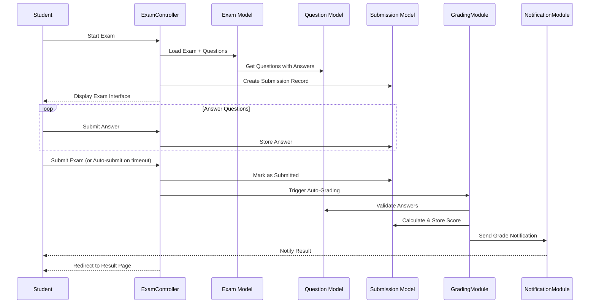
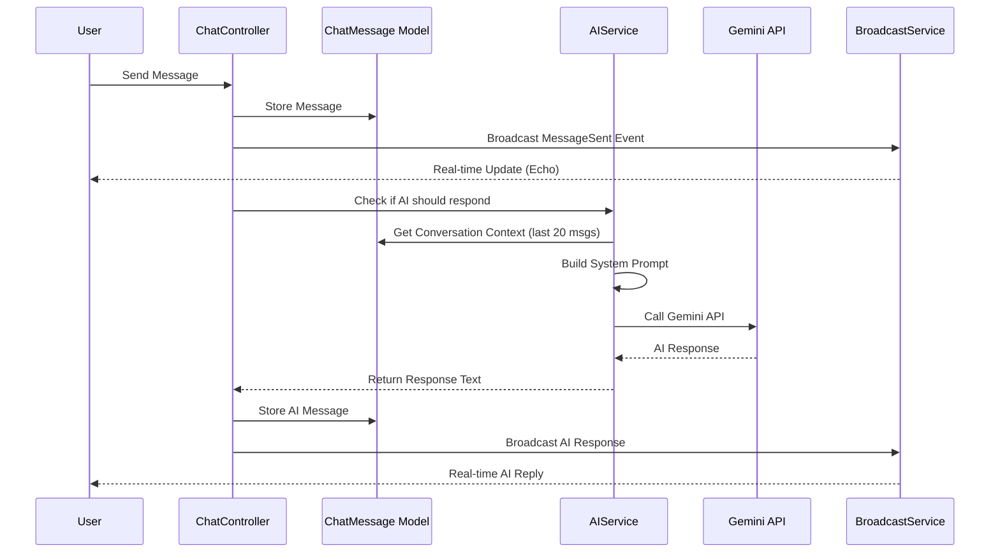
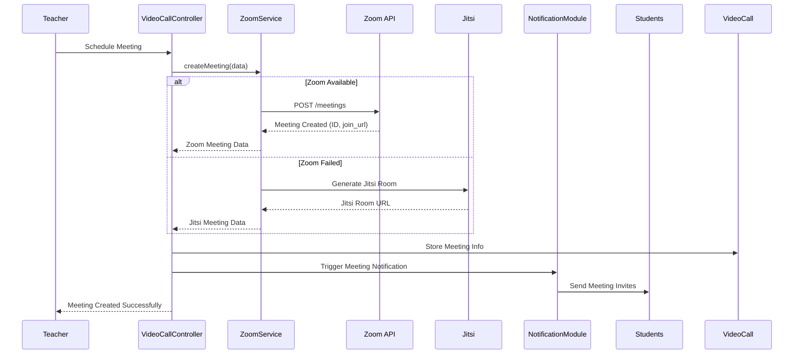
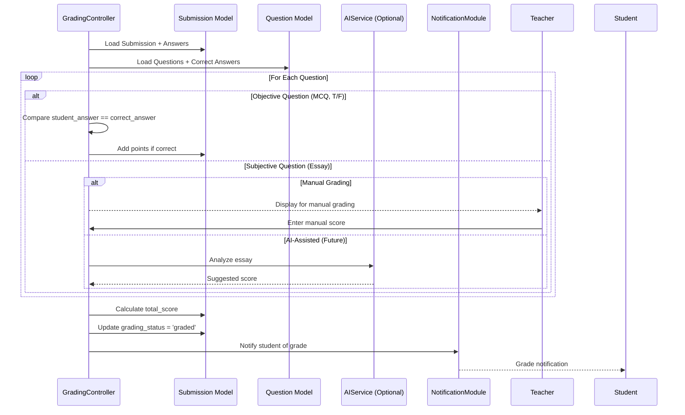
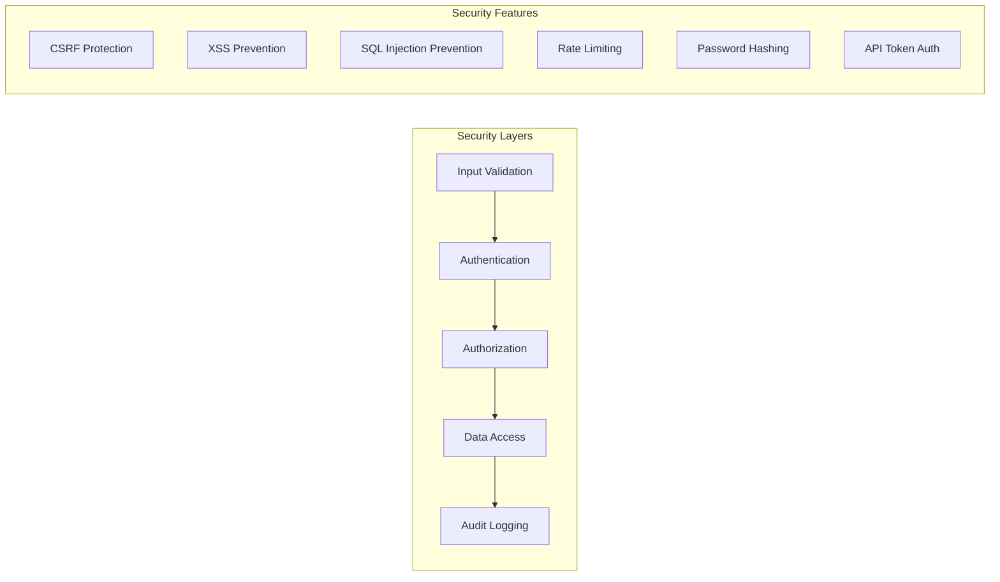

# 🏗️ Component Diagram - MegaLearning System Architecture

> Architectural diagram showing system components and their interactions

**Document Version:** 1.0  
**Last Updated:** December 19, 2025  
**System:** MegaLearning E-Learning Platform

---

## 📋 Table of Contents

1. [Overview](#overview)
2. [High-Level Component Diagram](#high-level-component-diagram)
3. [Core Modules](#core-modules)
4. [External Services Integration](#external-services-integration)
5. [Data Flow Diagrams](#data-flow-diagrams)
6. [Component Interactions](#component-interactions)

---

## Overview

The MegaLearning platform follows a **modular architecture** with clear separation of concerns. The system is divided into multiple modules that interact through well-defined interfaces and APIs.

### Architecture Style
- **Layered Architecture** (Presentation → Application → Business → Data)
- **Service-Oriented Architecture** (SOA) for external integrations
- **Event-Driven Architecture** for real-time features
- **RESTful API** for client-server communication

---

## High-Level Component Diagram

```mermaid
graph TB
    subgraph "Presentation Layer"
        WebUI[Web Interface<br/>Blade Templates + Tailwind]
        API[RESTful API<br/>JSON Responses]
    end

    subgraph "Application Layer - Core Modules"
        UserMgmt[User Management Module<br/>Admin, Teacher, Student]
        SubjectMgmt[Subject & Topic Module<br/>Course Structure]
        ExamMgmt[Exam Management Module<br/>Create, Publish, Monitor]
        QuestionBank[Question Bank Module<br/>Questions & Answers]
        GradingModule[Grading Module<br/>Auto & Manual Grading]
        ChatModule[Chat & Communication Module<br/>Real-time Messaging]
        VideoModule[Video Call Module<br/>Virtual Classrooms]
        DocumentModule[Document Management Module<br/>File Upload & Share]
        ForumModule[Forum/Q&A Module<br/>Discussion & Voting]
        NotificationModule[Notification Module<br/>Real-time Alerts]
        ReportModule[Report & Analytics Module<br/>Statistics & Insights]
    end

    subgraph "Business Logic Layer - Services"
        AIService[AI Service<br/>Gemini Integration]
        ZoomService[Zoom Service<br/>Video API]
        EmailService[Email Service<br/>Brevo/SMTP]
        FileService[File Service<br/>Google Drive]
        BroadcastService[Broadcast Service<br/>Pusher/Echo]
        AuthService[Auth Service<br/>Sanctum]
    end

    subgraph "Data Access Layer"
        Eloquent[Eloquent ORM<br/>Models & Relationships]
        QueryBuilder[Query Builder<br/>Database Queries]
        Cache[Cache Layer<br/>Redis/File]
    end

    subgraph "Data Layer"
        MySQL[(MySQL Database<br/>45+ Tables)]
        Storage[File Storage<br/>Local/S3/Google Drive]
    end

    subgraph "External Services"
        ZoomAPI[Zoom API<br/>Video Conferencing]
        GeminiAPI[Google Gemini AI<br/>AI Assistant]
        PusherAPI[Pusher<br/>Real-time Broadcasting]
        BrevoAPI[Brevo<br/>Email Service]
        GoogleDrive[Google Drive API<br/>Cloud Storage]
        JitsiAPI[Jitsi Meet<br/>Fallback Video]
    end

    %% Presentation to Application Layer
    WebUI --> UserMgmt
    WebUI --> SubjectMgmt
    WebUI --> ExamMgmt
    WebUI --> ChatModule
    WebUI --> VideoModule
    WebUI --> DocumentModule
    WebUI --> ForumModule
    
    API --> UserMgmt
    API --> ExamMgmt
    API --> ChatModule
    API --> QuestionBank

    %% Core Module Interactions
    ExamMgmt --> QuestionBank
    ExamMgmt --> GradingModule
    GradingModule --> NotificationModule
    SubjectMgmt --> ExamMgmt
    SubjectMgmt --> DocumentModule
    ChatModule --> NotificationModule
    ForumModule --> NotificationModule
    VideoModule --> NotificationModule
    
    UserMgmt --> SubjectMgmt
    UserMgmt --> ExamMgmt
    UserMgmt --> ChatModule

    %% Module to Service Layer
    ChatModule --> AIService
    ChatModule --> BroadcastService
    VideoModule --> ZoomService
    NotificationModule --> BroadcastService
    NotificationModule --> EmailService
    DocumentModule --> FileService
    UserMgmt --> AuthService
    GradingModule --> AIService
    ReportModule --> ExamMgmt
    ReportModule --> GradingModule

    %% Service to External APIs
    AIService --> GeminiAPI
    ZoomService --> ZoomAPI
    ZoomService --> JitsiAPI
    BroadcastService --> PusherAPI
    EmailService --> BrevoAPI
    FileService --> GoogleDrive

    %% Data Access
    UserMgmt --> Eloquent
    SubjectMgmt --> Eloquent
    ExamMgmt --> Eloquent
    QuestionBank --> Eloquent
    GradingModule --> Eloquent
    ChatModule --> Eloquent
    VideoModule --> Eloquent
    DocumentModule --> Eloquent
    ForumModule --> Eloquent
    
    Eloquent --> MySQL
    QueryBuilder --> MySQL
    DocumentModule --> Storage
    Cache --> MySQL

    %% Styling
    classDef coreModule fill:#667eea,stroke:#333,stroke-width:2px,color:#fff
    classDef service fill:#f093fb,stroke:#333,stroke-width:2px,color:#fff
    classDef external fill:#4facfe,stroke:#333,stroke-width:2px,color:#fff
    classDef data fill:#43e97b,stroke:#333,stroke-width:2px,color:#fff
    
    class UserMgmt,SubjectMgmt,ExamMgmt,QuestionBank,GradingModule,ChatModule,VideoModule,DocumentModule,ForumModule,NotificationModule,ReportModule coreModule
    class AIService,ZoomService,EmailService,FileService,BroadcastService,AuthService service
    class ZoomAPI,GeminiAPI,PusherAPI,BrevoAPI,GoogleDrive,JitsiAPI external
    class MySQL,Storage,Eloquent,QueryBuilder,Cache data
```



---

## Core Modules

### 1. User Management Module
**Responsibilities:**
- User authentication & authorization
- Role-based access control (Admin, Teacher, Student)
- User profile management
- Password reset functionality

**Key Components:**
```
UserManagementController (Admin)
AuthController
ProfileController
Policies: AdminPolicy, TeacherPolicy, StudentPolicy
Models: User, Role, Permission
```

**Interactions:**
- → Subject Module (enrollment)
- → Exam Module (access control)
- → Chat Module (user identification)
- ← Auth Service (authentication)

---

### 2. Subject & Topic Module
**Responsibilities:**
- Course structure management
- Subject creation & organization
- Topic hierarchy
- Class room management

**Key Components:**
```
SubjectController (Teacher/Admin)
TopicController
CategoryController
Models: Subject, Topic, Category, ClassRoom
```

**Interactions:**
- → Exam Module (subject-exam linking)
- → Document Module (course materials)
- → User Module (teacher assignment)
- → Chat Module (subject-based chat rooms)

---

### 3. Exam Management Module
**Responsibilities:**
- Exam creation & configuration
- Question assignment
- Time limits & scheduling
- Security settings (anti-cheating)
- Exam publishing & monitoring

**Key Components:**
```
ExamController (Teacher/Student)
ExamManagementController (Admin)
Models: Exam, ExamQuestion, ExamSubmission
Security: Access codes, tab detection, camera requirement
```

**Interactions:**
- ← Question Bank (question selection)
- → Grading Module (submission processing)
- → Notification Module (exam alerts)
- ← Subject Module (subject context)

**Workflow:**
```
1. Teacher creates exam
2. Assigns questions from Question Bank
3. Configures security settings
4. Publishes to students
5. Students take exam
6. Auto-submit on time expiry
7. → Grading Module
```

---

### 4. Question Bank Module
**Responsibilities:**
- Question creation & management
- Answer options management
- Question categorization (topic, difficulty, type)
- Import/Export functionality

**Key Components:**
```
QuestionController (Teacher)
QuestionManagementController (Admin)
Models: Question, Answer
Types: Multiple choice, True/False, Essay, Fill-in-blank
```

**Interactions:**
- ← Exam Module (question usage)
- ← Subject/Topic Module (categorization)
- → Grading Module (answer validation)

---

### 5. Grading Module
**Responsibilities:**
- Auto-grading (objective questions)
- Manual grading (subjective questions)
- Score calculation
- Grade distribution
- AI-assisted grading (future)

**Key Components:**
```
GradingController
Models: Grade, ExamSubmission
Algorithms: Point calculation, partial credit
```

**Interactions:**
- ← Exam Module (submissions)
- ← Question Bank (correct answers)
- → Notification Module (grade notifications)
- → Report Module (statistics)
- ← AI Service (essay grading - optional)

**Auto-Grading Algorithm:**
```php
foreach (objective_questions as question) {
    if (student_answer == correct_answer) {
        score += question_points
    }
}
total_score = (score / total_points) * 100
```

---

### 6. Chat & Communication Module
**Responsibilities:**
- Real-time messaging
- Group chat (class-based)
- Private messaging
- AI chatbot integration
- Message history & search

**Key Components:**
```
ChatController
ChatApiController
Models: ChatRoom, ChatMessage, ChatRoomMember
Services: AIService, BroadcastService
```

**Interactions:**
- ← AI Service (bot responses)
- ← Broadcast Service (real-time updates)
- → Notification Module (new message alerts)
- ← User Module (participant info)
- ← Subject Module (subject-based rooms)

**Real-time Flow:**
```
1. User sends message
2. Store in database
3. Broadcast via Pusher/Echo
4. Trigger MessageSent event
5. If AI room → AIService generates response
6. Broadcast AI response
```

---

### 7. Video Call Module
**Responsibilities:**
- Video conferencing setup
- Meeting scheduling
- Recording management
- Participant management

**Key Components:**
```
VideoCallController (Teacher/Student)
ZoomService
Models: VideoCall
APIs: Zoom API (primary), Jitsi (fallback)
```

**Interactions:**
- ← Zoom Service (API calls)
- → Notification Module (meeting reminders)
- ← User Module (participant authentication)
- ← Subject Module (class context)

**Meeting Creation Flow:**
```
1. Teacher schedules meeting
2. ZoomService.createMeeting()
3. Store meeting details
4. Generate join links
5. Send notifications to participants
6. Monitor meeting status
```

---

### 8. Document Management Module
**Responsibilities:**
- File upload & storage
- Document organization (folders)
- Access control
- File sharing
- Download tracking

**Key Components:**
```
DocumentController
GoogleDriveService
Models: Document
Storage: Local, S3, Google Drive
```

**Interactions:**
- ← File Service (storage operations)
- ← Subject Module (course materials)
- ← User Module (access permissions)

---

### 9. Forum/Q&A Module
**Responsibilities:**
- Question posting
- Answer submission
- Voting system (upvote/downvote)
- Best answer selection
- Search & filtering

**Key Components:**
```
ForumQuestionController
Models: ForumQuestion, ForumAnswer, Vote
Features: Stack Overflow-style
```

**Interactions:**
- ← User Module (author info)
- → Notification Module (answer alerts)
- ← Subject Module (topic context)

---

### 10. Notification Module
**Responsibilities:**
- Real-time notifications
- Notification persistence
- Push notifications
- Email notifications
- Notification preferences

**Key Components:**
```
NotificationController
Models: Notification
Channels: Database, Broadcast, Mail
```

**Interactions:**
- ← Multiple modules (event triggers)
- → Broadcast Service (real-time delivery)
- → Email Service (email delivery)

**Event-Driven Architecture:**
```
Events:
- ExamPublished → Notify students
- GradeReleased → Notify student
- MessageReceived → Notify recipient
- MeetingScheduled → Notify participants
- AnswerPosted → Notify question author
```

---

### 11. Report & Analytics Module
**Responsibilities:**
- Performance analytics
- Grade statistics
- Student rankings
- Attendance tracking
- Export functionality

**Key Components:**
```
ReportsController
StatisticsController
Models: StudentRanking, Attendance
```

**Interactions:**
- ← Exam Module (exam data)
- ← Grading Module (score data)
- ← User Module (student info)

---

## External Services Integration

### AI Service Layer
```
┌─────────────────────────────────────┐
│         AI Service                  │
├─────────────────────────────────────┤
│ • Google Gemini AI Integration      │
│ • Context-aware responses           │
│ • Mock fallback mode                │
│ • Conversation history              │
└─────────────────────────────────────┘
         ↓                    ↑
    API Call            Response
         ↓                    ↑
┌─────────────────────────────────────┐
│      Google Gemini API              │
│  Model: gemini-2.5-flash            │
└─────────────────────────────────────┘
```

**Integration Points:**
- Chat Module (Q&A responses)
- Grading Module (essay evaluation - future)

---

### Zoom Service Layer
```
┌─────────────────────────────────────┐
│         Zoom Service                │
├─────────────────────────────────────┤
│ • Server-to-Server OAuth            │
│ • Meeting CRUD operations           │
│ • Recording management              │
│ • Jitsi fallback                    │
└─────────────────────────────────────┘
         ↓                    ↑
    API Call            Response
         ↓                    ↑
┌─────────────────────────────────────┐
│         Zoom API v2                 │
│  OAuth 2.0 Authentication           │
└─────────────────────────────────────┘
```

**Fallback Strategy:**
```
1. Try Zoom API
2. If failed → Use Jitsi Meet
3. Jitsi requires no authentication
4. Generate Jitsi room URL
```

---

### Broadcast Service Layer
```
┌─────────────────────────────────────┐
│      Broadcast Service              │
├─────────────────────────────────────┤
│ • Event broadcasting                │
│ • Presence channels                 │
│ • Private channels                  │
└─────────────────────────────────────┘
         ↓                    ↑
    Publish              Subscribe
         ↓                    ↑
┌─────────────────────────────────────┐
│         Pusher API                  │
│   + Laravel Echo (Client)           │
└─────────────────────────────────────┘
```

**Real-time Events:**
- `MessageSent` - Chat messages
- `NotificationCreated` - Notifications
- `ExamStarted` / `ExamEnded` - Exam events

---

### File Service Layer
```
┌─────────────────────────────────────┐
│        File Service                 │
├─────────────────────────────────────┤
│ • Multi-driver support              │
│ • Local / S3 / Google Drive         │
│ • File validation                   │
└─────────────────────────────────────┘
         ↓                    ↑
    Upload/Download       File URL
         ↓                    ↑
┌─────────────────────────────────────┐
│      Storage Providers              │
│  • Google Drive API                 │
│  • AWS S3 (optional)                │
│  • Local Filesystem                 │
└─────────────────────────────────────┘
```

---

## Data Flow Diagrams

### Exam Taking Flow


---

### Chat with AI Flow


---

### Video Call Creation Flow


---

### Grading Flow (Auto + Manual)


---

## Component Interactions Summary

### Module Dependency Matrix

| Module | Depends On | Depended By |
|--------|-----------|-------------|
| User Management | Auth Service | All modules |
| Subject & Topic | User, Document | Exam, Chat |
| Exam Management | Subject, Question Bank, User | Grading, Report |
| Question Bank | Subject/Topic | Exam, Grading |
| Grading | Exam, Question Bank, AI Service | Report, Notification |
| Chat | User, AI Service, Broadcast | Notification |
| Video Call | Zoom Service, User | Notification |
| Document | File Service, Subject | - |
| Forum/Q&A | User, Subject | Notification |
| Notification | Broadcast, Email Service | - |
| Report | Exam, Grading, User | - |

---

### Service Layer Dependencies

| Service | Used By | External API |
|---------|---------|--------------|
| AI Service | Chat, Grading | Google Gemini |
| Zoom Service | Video Call | Zoom API, Jitsi |
| Email Service | Notification, User | Brevo/SMTP |
| File Service | Document | Google Drive, S3 |
| Broadcast Service | Chat, Notification | Pusher |
| Auth Service | User, API | Laravel Sanctum |

---

## Technology Stack by Layer

```
┌────────────────────────────────────────────────────┐
│             PRESENTATION LAYER                     │
│  Blade Templates • Tailwind CSS • JavaScript       │
│  Laravel Echo • Axios • Bootstrap Icons            │
└────────────────────────────────────────────────────┘
                        ↓ ↑
┌────────────────────────────────────────────────────┐
│            APPLICATION LAYER (MVC)                 │
│  Controllers • Middleware • Policies • Requests    │
│  Routes • Views • Validation                       │
└────────────────────────────────────────────────────┘
                        ↓ ↑
┌────────────────────────────────────────────────────┐
│          BUSINESS LOGIC LAYER                      │
│  Services • Events • Listeners • Jobs • Observers  │
│  AIService • ZoomService • FileService             │
└────────────────────────────────────────────────────┘
                        ↓ ↑
┌────────────────────────────────────────────────────┐
│           DATA ACCESS LAYER                        │
│  Eloquent ORM • Query Builder • Repositories       │
│  Models • Relationships • Scopes                   │
└────────────────────────────────────────────────────┘
                        ↓ ↑
┌────────────────────────────────────────────────────┐
│              DATA LAYER                            │
│  MySQL 8.0 • Redis (Cache) • File Storage          │
│  45+ Tables • Indexes • Foreign Keys               │
└────────────────────────────────────────────────────┘
```

---

## Design Patterns Applied

### 1. **MVC Pattern**
- Controllers handle HTTP requests
- Models represent business entities
- Views render UI

### 2. **Service Layer Pattern**
```php
app/Services/
├── AIService.php          // Gemini AI integration
├── ZoomService.php        // Video conferencing
├── GoogleDriveService.php // File storage
└── ActivityLogger.php     // Logging service
```

### 3. **Repository Pattern** (Optional)
- Abstract data access logic
- Testable data layer

### 4. **Observer Pattern**
```php
Events:
├── MessageSent
├── NotificationCreated
├── ExamPublished
└── GradeReleased

Listeners respond to events automatically
```

### 5. **Policy Pattern**
```php
app/Policies/
├── AdminPolicy.php
├── TeacherPolicy.php
├── ExamPolicy.php
└── ChatRoomPolicy.php
```

### 6. **Factory Pattern**
```php
database/factories/
├── UserFactory.php
├── ExamFactory.php
└── QuestionFactory.php
```

### 7. **Singleton Pattern**
- Service container
- Configuration cache

---

## Security Architecture



**Security Components:**
- **Laravel Sanctum** - API authentication
- **Spatie Permission** - RBAC
- **Middleware** - Request filtering
- **Policies** - Action authorization
- **HTTPS** - Encrypted communication
- **Password Hashing** - Bcrypt

---

## Scalability Considerations

### Horizontal Scaling
```
Load Balancer
     │
     ├── App Server 1
     ├── App Server 2
     └── App Server 3
          │
     ┌────┴────┐
     │         │
  MySQL    Redis Cache
  (Master)  (Shared)
```

### Caching Strategy
- **Query Cache** - Redis
- **View Cache** - File/Redis
- **Config Cache** - File
- **Route Cache** - File

### Queue Processing
```
Queue Driver: Database/Redis/SQS
Workers: Multiple processes
Supervisor: Process monitoring
Jobs: Email, Notifications, Reports
```

---

## Future Enhancements

### Planned Modules
1. **Payment Module** (Stripe/PayPal integration)
2. **Certificate Module** (Auto-generate certificates)
3. **Gamification Module** (Badges, achievements)
4. **Mobile App** (React Native/Flutter)
5. **LMS Integration** (SCORM compliance)

### Advanced Features
- **AI Proctoring** (Facial recognition)
- **Speech-to-Text** (Lecture transcription)
- **Adaptive Learning** (Personalized paths)
- **Blockchain Certificates** (Verification)

---

## References

- **Laravel Documentation:** https://laravel.com/docs/12.x
- **System Architecture Patterns:** Martin Fowler
- **Microservices Patterns:** Chris Richardson
- **Clean Architecture:** Robert C. Martin

---

**Document Maintained By:** MegaLearning Development Team  
**Related Documents:**
- [TECH_STACK.md](../TECH_STACK.md) - Technology stack details
- [README.md](../README.md) - Project overview
- [API Documentation](../docs/API.md) - API endpoints

---

*This diagram provides a comprehensive view of the MegaLearning system architecture. For implementation details, refer to the source code and inline documentation.*
