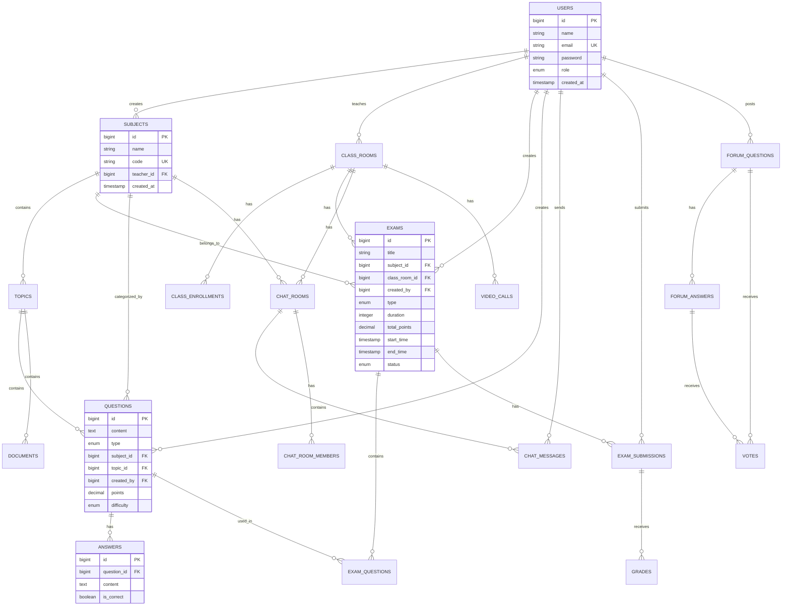

# CHƯƠNG 3: THIẾT KẾ CƠ SỞ DỮ LIỆU

> Tài liệu Học Thuật - Phân Tích và Thiết Kế Hệ Quản Trị Cơ Sở Dữ Liệu cho Nền Tảng E-Learning MegaLearning

**Khoa:** Công Nghệ Thông Tin  
**Học Phần:** Nhập Môn Công Nghệ Phần Mềm (INT1340)  
**Nhóm Thực Hiện:** Nhóm 5  
**Ngày Cập Nhật:** 20/12/2025

---

## MỤC LỤC

- [3.1. Giới Thiệu và Mục Tiêu](#31-giới-thiệu-và-mục-tiêu)
- [3.2. Phân Tích Yêu Cầu Cơ Sở Dữ Liệu](#32-phân-tích-yêu-cầu-cơ-sở-dữ-liệu)
- [3.3. Mô Hình Thực Thể - Liên Kết (ERD)](#33-mô-hình-thực-thể---liên-kết-erd)
- [3.4. Thiết Kế Lược Đồ Quan Hệ](#34-thiết-kế-lược-đồ-quan-hệ)
- [3.5. Chuẩn Hóa Cơ Sở Dữ Liệu](#35-chuẩn-hóa-cơ-sở-dữ-liệu)
- [3.6. Ràng Buộc Toàn Vẹn và Bảo Mật](#36-ràng-buộc-toàn-vẹn-và-bảo-mật)
- [3.7. Tối Ưu Hóa Hiệu Năng](#37-tối-ưu-hóa-hiệu-năng)
- [3.8. Migration và Quản Lý Phiên Bản](#38-migration-và-quản-lý-phiên-bản)
- [3.9. Kết Luận](#39-kết-luận)

---

## 3.1. Giới Thiệu và Mục Tiêu

### 3.1.1. Bối Cảnh

Cơ sở dữ liệu (CSDL) đóng vai trò nền tảng trong việc lưu trữ, quản lý và truy xuất thông tin cho hệ thống E-Learning MegaLearning. Việc thiết kế CSDL phù hợp không chỉ đảm bảo tính nhất quán và toàn vẹn dữ liệu mà còn ảnh hưởng trực tiếp đến hiệu năng, khả năng mở rộng và bảo mật của toàn bộ hệ thống.

### 3.1.2. Mục Tiêu Thiết Kế

Thiết kế CSDL cho hệ thống MegaLearning nhằm đạt được các mục tiêu sau:

1. **Tính Nhất Quán (Consistency):** Đảm bảo dữ liệu luôn chính xác và không mâu thuẫn thông qua các ràng buộc toàn vẹn
2. **Tính Toàn Vẹn (Integrity):** Áp dụng các ràng buộc khóa chính, khóa ngoại và kiểm tra giá trị
3. **Hiệu Năng Cao (Performance):** Tối ưu hóa truy vấn thông qua indexing và chuẩn hóa
4. **Khả Năng Mở Rộng (Scalability):** Thiết kế linh hoạt cho phép bổ sung tính năng mới
5. **Bảo Mật (Security):** Mã hóa dữ liệu nhạy cảm và kiểm soát truy cập
6. **Khả Năng Bảo Trì (Maintainability):** Cấu trúc rõ ràng, dễ hiểu và quản lý

### 3.1.3. Hệ Quản Trị Cơ Sở Dữ Liệu

**Hệ QTCSDL Lựa Chọn:** MySQL 8.0  
**Lý Do Lựa Chọn:**
- Hệ quản trị CSDL quan hệ (RDBMS) mã nguồn mở phổ biến
- Hỗ trợ ACID (Atomicity, Consistency, Isolation, Durability)
- Hiệu năng cao cho các truy vấn phức tạp
- Tích hợp tốt với Laravel Framework thông qua Eloquent ORM
- Cộng đồng hỗ trợ lớn và tài liệu phong phú

### 3.1.4. Quy Mô Cơ Sở Dữ Liệu

```
Tổng Quan CSDL MegaLearning:
├── Số Lượng Bảng: 51 bảng
├── Migrations Đã Thực Thi: 51 migrations
├── Tổng Số Cột: ~350+ cột
├── Quan Hệ Khóa Ngoại: ~80+ foreign keys
├── Indexes: ~120+ indexes
└── Ước Lượng Dung Lượng: 100MB - 10GB (tùy quy mô sử dụng)
```

---

## 3.2. Phân Tích Yêu Cầu Cơ Sở Dữ Liệu

### 3.2.1. Yêu Cầu Chức Năng Đối Với CSDL

Dựa trên phân tích nghiệp vụ hệ thống, CSDL cần hỗ trợ các chức năng sau:

#### A. Quản Lý Người Dùng và Phân Quyền
- Lưu trữ thông tin tài khoản (Admin, Teacher, Student)
- Quản lý vai trò và quyền hạn (Role-Based Access Control)
- Theo dõi lịch sử đăng nhập và hoạt động
- Hỗ trợ xác thực API (token-based authentication)

#### B. Quản Lý Học Liệu
- Cấu trúc phân cấp: Danh mục → Môn học → Chủ đề
- Lưu trữ metadata tài liệu học tập
- Quản lý lớp học và đăng ký học viên
- Theo dõi tiến độ học tập

#### C. Quản Lý Thi Cử và Đánh Giá
- Ngân hàng câu hỏi với phân loại đa chiều
- Cấu trúc đề thi linh hoạt
- Lưu trữ bài làm và quá trình làm bài
- Tính toán và lưu trữ điểm số
- Xếp hạng và thống kê

#### D. Giao Tiếp và Tương Tác
- Phòng chat theo lớp học/nhóm
- Lịch sử tin nhắn và trạng thái đọc
- Tích hợp AI chatbot
- Video call metadata
- Diễn đàn hỏi đáp với voting

#### E. Thông Báo và Hoạt Động
- Hệ thống thông báo đa kênh
- Activity logs cho audit trail
- Điểm danh và theo dõi sự kiện

### 3.2.2. Yêu Cầu Phi Chức Năng

#### A. Yêu Cầu Về Hiệu Năng
- **Thời gian phản hồi truy vấn:** < 100ms cho 95% queries
- **Throughput:** Hỗ trợ 1000+ concurrent users
- **Latency:** < 500ms cho real-time features (chat, notifications)

#### B. Yêu Cầu Về Bảo Mật
- **Mã hóa mật khẩu:** Bcrypt với cost factor 12
- **HTTPS/TLS:** Mã hóa dữ liệu truyền tải
- **SQL Injection Prevention:** Prepared statements (Eloquent ORM)
- **Access Control:** Row-level security cho dữ liệu nhạy cảm

#### C. Yêu Cầu Về Sẵn Sàng
- **Uptime target:** 99.5% availability
- **Backup frequency:** Daily automated backups
- **Recovery time objective (RTO):** < 4 hours
- **Recovery point objective (RPO):** < 1 hour

#### D. Yêu Cầu Về Khả Năng Mở Rộng
- Hỗ trợ horizontal scaling (read replicas)
- Partitioning strategy cho bảng lớn
- Caching layer (Redis) cho queries phổ biến

---

## 3.3. Mô Hình Thực Thể - Liên Kết (ERD)

### 3.3.1. Sơ Đồ ERD Tổng Quan



### 3.3.2. Giải Thích Các Thực Thể Chính

#### **USERS (Người Dùng)**
**Mục đích:** Lưu trữ thông tin tài khoản người dùng hệ thống

**Thuộc tính:**
- `id` (PK): Khóa chính tự tăng
- `name`: Họ và tên người dùng
- `email` (UNIQUE): Email đăng nhập (ràng buộc duy nhất)
- `password`: Mật khẩu đã băm (bcrypt)
- `role`: Vai trò (admin/teacher/student)
- `email_verified_at`: Thời điểm xác thực email
- `created_at`, `updated_at`: Timestamps

**Quan hệ:**
- 1-N với SUBJECTS (giảng viên tạo nhiều môn học)
- 1-N với EXAMS (giảng viên tạo nhiều đề thi)
- 1-N với QUESTIONS (giảng viên tạo nhiều câu hỏi)
- 1-N với EXAM_SUBMISSIONS (học sinh nộp nhiều bài thi)
- N-N với CLASS_ROOMS (qua CLASS_ENROLLMENTS)

#### **SUBJECTS (Môn Học)**
**Mục đích:** Tổ chức cấu trúc học liệu theo môn học

**Thuộc tính:**
- `id` (PK): Khóa chính
- `name`: Tên môn học
- `code` (UNIQUE): Mã môn học duy nhất
- `description`: Mô tả chi tiết
- `teacher_id` (FK, NULLABLE): Giảng viên phụ trách
- `category_id` (FK, NULLABLE): Danh mục

**Quan hệ:**
- 1-N với TOPICS (một môn có nhiều chủ đề)
- 1-N với EXAMS (một môn có nhiều đề thi)
- 1-N với QUESTIONS (ngân hàng câu hỏi theo môn)

#### **TOPICS (Chủ Đề)**
**Mục đích:** Tổ chức nội dung học tập theo chủ đề

**Thuộc tính:**
- `id` (PK): Khóa chính
- `name`: Tên chủ đề
- `subject_id` (FK): Thuộc môn học nào
- `order`: Thứ tự hiển thị
- `content`: Nội dung chi tiết

#### **EXAMS (Đề Thi)**
**Mục đích:** Quản lý thông tin kỳ thi

**Thuộc tính:**
- `id` (PK): Khóa chính
- `title`: Tiêu đề đề thi
- `description`: Mô tả
- `subject_id` (FK): Môn thi
- `class_room_id` (FK): Lớp học
- `created_by` (FK): Người tạo đề
- `type`: Loại thi (quiz/midterm/final/practice)
- `duration`: Thời lượng (phút)
- `total_points`: Tổng điểm
- `start_time`, `end_time`: Thời gian mở/đóng đề
- `status`: Trạng thái (draft/published/archived)
- `shuffle_questions`, `shuffle_answers`: Cấu hình xáo trộn
- `allow_review`: Cho phép xem lại
- **Security fields:**
  - `require_access_code`: Yêu cầu mã truy cập
  - `access_code`: Mã bảo mật
  - `detect_tab_switch`: Phát hiện chuyển tab
  - `require_camera`: Yêu cầu camera

**Quan hệ:**
- N-N với QUESTIONS (qua EXAM_QUESTIONS)
- 1-N với EXAM_SUBMISSIONS

#### **QUESTIONS (Câu Hỏi)**
**Mục đích:** Ngân hàng câu hỏi

**Thuộc tính:**
- `id` (PK): Khóa chính
- `content`: Nội dung câu hỏi (TEXT)
- `type`: Loại (multiple_choice/true_false/essay/fill_blank)
- `subject_id` (FK): Môn học
- `topic_id` (FK): Chủ đề
- `created_by` (FK): Người tạo
- `points`: Điểm số (DECIMAL 5,2)
- `difficulty`: Độ khó (easy/medium/hard)
- `explanation`: Giải thích đáp án
- `image_url`: Đường dẫn hình ảnh
- `in_question_bank`: Flag ngân hàng câu hỏi

**Indexes:**
```sql
INDEX idx_subject_bank (subject_id, in_question_bank)
INDEX idx_difficulty (difficulty)
```

#### **ANSWERS (Đáp Án)**
**Mục đích:** Lưu các lựa chọn trả lời

**Thuộc tính:**
- `id` (PK): Khóa chính
- `question_id` (FK): Thuộc câu hỏi nào
- `content`: Nội dung đáp án
- `is_correct`: Đáp án đúng (BOOLEAN)
- `order`: Thứ tự hiển thị

**Ràng buộc:**
- Mỗi câu hỏi trắc nghiệm phải có ít nhất 1 đáp án đúng
- Câu hỏi True/False có đúng 2 đáp án

#### **EXAM_QUESTIONS (Bảng Trung Gian)**
**Mục đích:** Liên kết đề thi với câu hỏi (Many-to-Many)

**Thuộc tính:**
- `id` (PK): Khóa chính
- `exam_id` (FK): Đề thi
- `question_id` (FK): Câu hỏi
- `order`: Thứ tự câu hỏi trong đề
- `points`: Điểm riêng cho câu này (có thể khác question.points)
- `custom_type`: Loại tùy chỉnh
- `custom_content`: Nội dung tùy chỉnh
- `custom_answers`: JSON lưu đáp án tùy chỉnh

**Ý nghĩa:** Cho phép tái sử dụng câu hỏi trong nhiều đề thi với điểm số khác nhau

#### **EXAM_SUBMISSIONS (Bài Làm)**
**Mục đích:** Lưu trữ bài thi của học sinh

**Thuộc tính:**
- `id` (PK): Khóa chính
- `exam_id` (FK): Đề thi
- `student_id` (FK): Học sinh
- `answers`: JSON lưu đáp án đã chọn
- `status`: Trạng thái (in_progress/submitted/graded)
- `grading_status`: Trạng thái chấm (pending/auto_graded/graded)
- `score`: Điểm số
- `started_at`: Thời gian bắt đầu
- `submitted_at`: Thời gian nộp
- `graded_at`: Thời gian chấm
- `graded_by` (FK): Người chấm
- `attempt_number`: Lần thi thứ mấy
- **Metadata:**
  - `ip_address`: IP làm bài
  - `user_agent`: Thông tin trình duyệt
  - `tab_switches`: Số lần chuyển tab

**JSON Structure của `answers`:**
```json
{
  "question_1": {
    "question_id": 1,
    "selected_answer": 3,
    "is_correct": true,
    "points_earned": 2.5
  },
  "question_2": {
    "question_id": 2,
    "essay_answer": "Nội dung trả lời tự luận...",
    "points_earned": 0
  }
}
```

#### **CHAT_ROOMS (Phòng Chat)**
**Mục đích:** Quản lý các phòng trò chuyện

**Thuộc tính:**
- `id` (PK): Khóa chính
- `name`: Tên phòng
- `room_type`: Loại (group/private/subject/class)
- `subject_id` (FK, NULLABLE): Liên kết môn học
- `class_room_id` (FK, NULLABLE): Liên kết lớp học
- `created_by` (FK): Người tạo
- `is_active`: Trạng thái hoạt động
- `include_ai`: Có AI chatbot không

#### **CHAT_MESSAGES (Tin Nhắn)**
**Mục đích:** Lưu trữ nội dung tin nhắn

**Thuộc tính:**
- `id` (PK): Khóa chính
- `room_id` (FK): Phòng chat
- `user_id` (FK, NULLABLE): Người gửi (NULL = AI)
- `message`: Nội dung (TEXT)
- `is_ai`: Tin nhắn từ AI (BOOLEAN)
- `is_deleted`: Đã xóa (soft delete)
- `created_at`: Timestamp

**Index:**
```sql
INDEX idx_room_created (room_id, created_at DESC)
```

#### **FORUM_QUESTIONS & FORUM_ANSWERS (Diễn Đàn)**
**Mục đích:** Hệ thống hỏi đáp kiểu Stack Overflow

**FORUM_QUESTIONS:**
- `id` (PK)
- `title`: Tiêu đề câu hỏi
- `body`: Nội dung chi tiết
- `user_id` (FK): Người hỏi
- `subject_id` (FK, NULLABLE)
- `views`: Lượt xem
- `votes`: Điểm vote
- `is_solved`: Đã giải quyết

**FORUM_ANSWERS:**
- `id` (PK)
- `forum_question_id` (FK)
- `user_id` (FK): Người trả lời
- `body`: Nội dung trả lời
- `votes`: Điểm vote
- `is_best_answer`: Câu trả lời hay nhất

**VOTES:**
- `id` (PK)
- `user_id` (FK)
- `votable_type`: Polymorphic type (Question/Answer)
- `votable_id`: Polymorphic ID
- `vote_type`: Upvote/Downvote

---

## 3.4. Thiết Kế Lược Đồ Quan Hệ

### 3.4.1. Phân Nhóm Chức Năng

Hệ thống CSDL được tổ chức thành 8 nhóm chức năng logic:

#### **Nhóm 1: Xác Thực và Phân Quyền (8 bảng)**
```
users
password_reset_tokens
personal_access_tokens (Sanctum)
roles
permissions
role_has_permissions
model_has_roles
model_has_permissions
```

**Mô hình RBAC (Role-Based Access Control):**
- Sử dụng package Spatie Laravel Permission
- Hỗ trợ gán quyền trực tiếp hoặc qua vai trò
- Polymorphic relationships cho linh hoạt

#### **Nhóm 2: Cấu Trúc Học Liệu (10 bảng)**
```
categories (Danh mục khóa học)
subjects (Môn học)
topics (Chủ đề)
class_rooms (Lớp học)
class_enrollments (Đăng ký lớp học)
documents (Tài liệu)
attendance (Điểm danh)
```

**Hierarchy:**
```
Categories
└── Subjects
    └── Topics
        └── Documents
```

#### **Nhóm 3: Thi Cử và Đánh Giá (12 bảng)**
```
exams
questions
answers
exam_questions (pivot)
exam_submissions
grades
student_rankings (Bảng xếp hạng)
```

**Workflow:**
```
Question Bank → Exam Creation → Exam Taking → Submission → Grading → Ranking
```

#### **Nhóm 4: Giao Tiếp (8 bảng)**
```
chat_rooms
chat_messages
chat_room_members (pivot)
chat_message_reads (Theo dõi đã đọc)
video_calls (Zoom/Jitsi metadata)
forum_questions
forum_answers
votes (Polymorphic)
```

#### **Nhóm 5: Thông Báo và Hoạt Động (4 bảng)**
```
notifications
activity_logs (Audit trail)
failed_jobs (Queue monitoring)
```

#### **Nhóm 6: Hệ Thống (5 bảng)**
```
settings (Cấu hình hệ thống)
cache (Application cache)
cache_locks
sessions
jobs (Queue jobs)
```

#### **Nhóm 7: Telescope Debug (4 bảng)**
```
telescope_entries
telescope_entries_tags
telescope_monitoring
telescope_usage
```

### 3.4.2. Bảng Mô Tả Chi Tiết Các Bảng Chính

| Tên Bảng | Số Cột | PK | FK | Indexes | Mục Đích |
|-----------|--------|----|----|---------|----------|
| users | 15 | id | 0 | 3 | Quản lý người dùng |
| subjects | 10 | id | 2 | 2 | Quản lý môn học |
| topics | 12 | id | 1 | 2 | Nội dung chủ đề |
| exams | 35 | id | 3 | 5 | Quản lý đề thi |
| questions | 17 | id | 3 | 4 | Ngân hàng câu hỏi |
| answers | 6 | id | 1 | 1 | Đáp án câu hỏi |
| exam_questions | 10 | id | 2 | 2 | Liên kết đề-câu hỏi |
| exam_submissions | 20 | id | 3 | 6 | Bài làm học sinh |
| grades | 8 | id | 2 | 2 | Điểm số |
| chat_rooms | 12 | id | 3 | 3 | Phòng chat |
| chat_messages | 10 | id | 2 | 2 | Tin nhắn |
| class_rooms | 14 | id | 2 | 3 | Lớp học |
| class_enrollments | 8 | id | 2 | 2 | Đăng ký học |
| forum_questions | 13 | id | 2 | 4 | Câu hỏi diễn đàn |
| student_rankings | 9 | id | 1 | 2 | Xếp hạng |

### 3.4.3. Quan Hệ Khóa Ngoại

**Ví dụ Definition:**

```sql
-- Bảng subjects
FOREIGN KEY (teacher_id) 
    REFERENCES users(id) 
    ON DELETE SET NULL
    ON UPDATE CASCADE

FOREIGN KEY (category_id)
    REFERENCES categories(id)
    ON DELETE SET NULL
    ON UPDATE CASCADE

-- Bảng exams
FOREIGN KEY (subject_id)
    REFERENCES subjects(id)
    ON DELETE CASCADE
    ON UPDATE CASCADE

FOREIGN KEY (class_room_id)
    REFERENCES class_rooms(id)
    ON DELETE CASCADE

FOREIGN KEY (created_by)
    REFERENCES users(id)
    ON DELETE CASCADE

-- Bảng exam_submissions
FOREIGN KEY (exam_id)
    REFERENCES exams(id)
    ON DELETE CASCADE

FOREIGN KEY (student_id)
    REFERENCES users(id)
    ON DELETE CASCADE
```

**Chính sách ON DELETE:**
- `CASCADE`: Xóa cascade khi parent bị xóa (exam → submissions)
- `SET NULL`: Đặt NULL khi parent bị xóa (teacher_id trong subjects)
- `RESTRICT`: Ngăn xóa nếu có child records (ít dùng)

---

## 3.5. Chuẩn Hóa Cơ Sở Dữ Liệu

### 3.5.1. Mục Tiêu Chuẩn Hóa

Áp dụng lý thuyết chuẩn hóa CSDL nhằm:
1. Loại bỏ dư thừa dữ liệu
2. Đảm bảo tính nhất quán
3. Tối ưu hóa không gian lưu trữ
4. Tăng hiệu năng cập nhật

### 3.5.2. Dạng Chuẩn Đạt Được

#### **Dạng Chuẩn 1 (1NF - First Normal Form)**

**Định nghĩa:** Mọi thuộc tính chỉ chứa giá trị đơn (atomic), không chứa tập hợp

**Ví dụ Vi Phạm:**
```
❌ SAI:
exams (id, title, question_ids: "1,2,3,4")

✅ ĐÚNG:
exams (id, title)
exam_questions (exam_id, question_id, order)
```

**Đánh giá:** Toàn bộ CSDL đạt 1NF

#### **Dạng Chuẩn 2 (2NF - Second Normal Form)**

**Định nghĩa:** Đạt 1NF và mọi thuộc tính không khóa phụ thuộc hoàn toàn vào khóa chính

**Ví dụ:**
```sql
-- Bảng class_enrollments
CREATE TABLE class_enrollments (
    id BIGINT PRIMARY KEY,
    user_id BIGINT,
    class_room_id BIGINT,
    enrollment_date DATETIME,
    status ENUM('active', 'inactive'),
    -- Không có thuộc tính phụ thuộc một phần
    FOREIGN KEY (user_id) REFERENCES users(id),
    FOREIGN KEY (class_room_id) REFERENCES class_rooms(id)
);
```

**Đánh giá:** Toàn bộ CSDL đạt 2NF

#### **Dạng Chuẩn 3 (3NF - Third Normal Form)**

**Định nghĩa:** Đạt 2NF và không có phụ thuộc bắc cầu

**Phân tích:**

**❌ Vi phạm (nếu có):**
```
users (id, name, city_id, city_name, city_population)
// city_name phụ thuộc vào city_id (bắc cầu)
```

**✅ Đúng:**
```
users (id, name, city_id)
cities (id, name, population)
```

**Đánh giá:** CSDL đạt 3NF cho hầu hết bảng

#### **Dạng Chuẩn Boyce-Codd (BCNF)**

**Định nghĩa:** Mọi determinant đều là khóa candidate

**Đánh giá:** Hầu hết bảng đạt BCNF do thiết kế đơn giản với single-column primary keys

### 3.5.3. Denormalization Có Chủ Đích

Một số trường hợp cố ý denormalize để tối ưu hiệu năng:

#### **Ví dụ 1: Vote Counting**
```sql
forum_questions (
    id,
    title,
    votes INT DEFAULT 0  -- Denormalized aggregate
)

-- Thay vì COUNT từ bảng votes mỗi lần
```

**Lý do:** Tránh expensive JOIN và COUNT operations

#### **Ví dụ 2: Student Rankings**
```sql
student_rankings (
    id,
    user_id,
    total_points INT,  -- Denormalized sum
    total_exams INT,   -- Denormalized count
    average_score DECIMAL
)
```

**Lý do:** Bảng xếp hạng cần tính toán nhanh, dữ liệu chỉ cập nhật theo batch

#### **Trade-off:**
- **Pros:** Tăng tốc độ đọc (read-heavy operations)
- **Cons:** Phức tạp hơn khi cập nhật (update anomalies)
- **Giải pháp:** Sử dụng Database Triggers hoặc Event Observers trong Laravel

---

## 3.6. Ràng Buộc Toàn Vẹn và Bảo Mật

### 3.6.1. Ràng Buộc Khóa Chính (Primary Key Constraints)

**Convention:**
- Tất cả bảng sử dụng `id` BIGINT UNSIGNED AUTO_INCREMENT
- Đảm bảo uniqueness và non-null

```sql
CREATE TABLE exams (
    id BIGINT UNSIGNED AUTO_INCREMENT PRIMARY KEY,
    ...
);
```

### 3.6.2. Ràng Buộc Khóa Ngoại (Foreign Key Constraints)

**Nguyên tắc:**
1. Tất cả khóa ngoại đều có index tự động
2. Tên cột FK theo convention: `{table}_id`
3. Chỉ định rõ ON DELETE và ON UPDATE behavior

**Ví dụ Migration:**
```php
Schema::create('exam_submissions', function (Blueprint $table) {
    $table->id();
    $table->foreignId('exam_id')
          ->constrained('exams')
          ->onDelete('cascade');
    $table->foreignId('student_id')
          ->constrained('users')
          ->onDelete('cascade');
    // ...
});
```

### 3.6.3. Ràng Buộc Duy Nhất (Unique Constraints)

```sql
-- Email duy nhất trong users
ALTER TABLE users ADD UNIQUE KEY idx_email (email);

-- Mã môn học duy nhất
ALTER TABLE subjects ADD UNIQUE KEY idx_code (code);

-- Một user chỉ đăng ký 1 lần vào 1 lớp
ALTER TABLE class_enrollments 
ADD UNIQUE KEY idx_user_class (user_id, class_room_id);
```

### 3.6.4. Ràng Buộc Kiểm Tra (Check Constraints - MySQL 8.0+)

```sql
-- Điểm số phải trong khoảng 0-100
ALTER TABLE exam_submissions 
ADD CONSTRAINT chk_score 
CHECK (score >= 0 AND score <= 100);

-- Duration phải > 0
ALTER TABLE exams 
ADD CONSTRAINT chk_duration 
CHECK (duration > 0);

-- Ngày kết thúc sau ngày bắt đầu
ALTER TABLE exams
ADD CONSTRAINT chk_dates
CHECK (end_time > start_time OR end_time IS NULL);
```

### 3.6.5. Ràng Buộc Mặc Định (Default Constraints)

```php
// Laravel Migration
$table->enum('status', ['draft', 'published', 'archived'])
      ->default('draft');

$table->boolean('is_active')->default(true);

$table->integer('points')->default(0);

$table->timestamp('created_at')->useCurrent();
```

### 3.6.6. Bảo Mật Dữ Liệu

#### **A. Mã Hóa Mật Khẩu**
```php
// Sử dụng Bcrypt với cost factor 12
password: Hash::make('plaintext')

// Verify
Hash::check('plaintext', $hashedPassword)
```

**Lưu trữ:**
```sql
users.password VARCHAR(255) -- $2y$12$...
```

#### **B. Soft Deletes**
```php
// Không xóa vật lý, chỉ đánh dấu
$table->softDeletes();

// Tạo cột deleted_at TIMESTAMP NULL
```

**Lợi ích:**
- Khôi phục dữ liệu khi cần
- Audit trail
- Tránh mất mát dữ liệu quan trọng

#### **C. Encryption at Rest**
- Sử dụng Laravel Encryption cho dữ liệu nhạy cảm
- MySQL TDE (Transparent Data Encryption) cho production

#### **D. Access Control**
```php
// Row-Level Security với Laravel Policies
Gate::define('view-exam', function (User $user, Exam $exam) {
    return $user->id === $exam->created_by 
        || $user->hasRole('admin');
});
```

---

## 3.7. Tối Ưu Hóa Hiệu Năng

### 3.7.1. Indexing Strategy

#### **A. Primary Key Indexes**
Tự động tạo bởi MySQL cho mọi PRIMARY KEY

#### **B. Foreign Key Indexes**
Laravel tự động tạo index cho foreign keys

#### **C. Composite Indexes**
```sql
-- Tìm kiếm câu hỏi theo môn + độ khó
CREATE INDEX idx_subject_difficulty 
ON questions(subject_id, difficulty);

-- Lọc bài thi theo lớp + trạng thái
CREATE INDEX idx_class_status 
ON exams(class_room_id, status);

-- Sắp xếp tin nhắn theo phòng + thời gian
CREATE INDEX idx_room_created 
ON chat_messages(room_id, created_at DESC);
```

#### **D. Full-Text Indexes**
```sql
-- Tìm kiếm nội dung câu hỏi
CREATE FULLTEXT INDEX idx_question_content 
ON questions(content);

-- Tìm kiếm forum
CREATE FULLTEXT INDEX idx_forum_search 
ON forum_questions(title, body);
```

**Sử dụng:**
```sql
SELECT * FROM questions 
WHERE MATCH(content) AGAINST('phương trình bậc hai' IN NATURAL LANGUAGE MODE);
```

### 3.7.2. Query Optimization

#### **A. Eager Loading (N+1 Problem)**
```php
// ❌ N+1 queries
$exams = Exam::all();
foreach ($exams as $exam) {
    echo $exam->subject->name; // +N queries
}

// ✅ 2 queries only
$exams = Exam::with('subject')->get();
```

#### **B. Select Specific Columns**
```php
// ❌ SELECT *
$users = User::all();

// ✅ SELECT id, name, email
$users = User::select('id', 'name', 'email')->get();
```

#### **C. Chunking Large Results**
```php
// Xử lý 1000 records mỗi lần
ExamSubmission::chunk(1000, function ($submissions) {
    foreach ($submissions as $submission) {
        // Process
    }
});
```

### 3.7.3. Caching Strategy

#### **A. Query Result Cache**
```php
// Cache 1 hour
$subjects = Cache::remember('subjects.all', 3600, function () {
    return Subject::with('teacher')->get();
});
```

#### **B. Model Attribute Cache**
```php
// Cache expensive computed attributes
public function getTotalPointsAttribute()
{
    return Cache::remember("user.{$this->id}.total_points", 600, function () {
        return $this->examSubmissions()->sum('score');
    });
}
```

### 3.7.4. Database Connection Pooling

**Config (config/database.php):**
```php
'mysql' => [
    'driver' => 'mysql',
    'host' => env('DB_HOST', '127.0.0.1'),
    'port' => env('DB_PORT', '3306'),
    'database' => env('DB_DATABASE', 'learning3'),
    'username' => env('DB_USERNAME', 'root'),
    'password' => env('DB_PASSWORD', ''),
    'charset' => 'utf8mb4',
    'collation' => 'utf8mb4_unicode_ci',
    'prefix' => '',
    'strict' => true,
    'engine' => 'InnoDB',
    'options' => extension_loaded('pdo_mysql') ? array_filter([
        PDO::MYSQL_ATTR_SSL_CA => env('MYSQL_ATTR_SSL_CA'),
        PDO::ATTR_PERSISTENT => true, // Connection pooling
    ]) : [],
],
```

### 3.7.5. Partitioning (Cho Bảng Lớn)

**Ví dụ: Partition `chat_messages` theo tháng**
```sql
ALTER TABLE chat_messages PARTITION BY RANGE (YEAR(created_at) * 100 + MONTH(created_at)) (
    PARTITION p202501 VALUES LESS THAN (202502),
    PARTITION p202502 VALUES LESS THAN (202503),
    PARTITION p202503 VALUES LESS THAN (202504),
    -- ...
    PARTITION pmax VALUES LESS THAN MAXVALUE
);
```

**Lợi ích:** Queries chỉ scan partition cần thiết

---

## 3.8. Migration và Quản Lý Phiên Bản

### 3.8.1. Laravel Migration System

**Mục đích:**
- Version control cho database schema
- Rollback capability
- Đồng bộ giữa development/staging/production

**Cấu trúc Migration:**
```php
<?php

use Illuminate\Database\Migrations\Migration;
use Illuminate\Database\Schema\Blueprint;
use Illuminate\Support\Facades\Schema;

return new class extends Migration
{
    /**
     * Run the migrations.
     */
    public function up(): void
    {
        Schema::create('exams', function (Blueprint $table) {
            $table->id();
            $table->string('title');
            $table->text('description')->nullable();
            $table->foreignId('subject_id')
                  ->constrained('subjects')
                  ->onDelete('cascade');
            // ... more columns
            $table->timestamps();
            
            // Indexes
            $table->index(['subject_id', 'status']);
        });
    }

    /**
     * Reverse the migrations.
     */
    public function down(): void
    {
        Schema::dropIfExists('exams');
    }
};
```

### 3.8.2. Migration Naming Convention

**Format:** `YYYY_MM_DD_HHmmss_description.php`

**Ví dụ:**
```
2025_11_07_104721_create_subjects_table.php
2025_11_07_104725_create_topics_table.php
2025_11_07_104729_create_exams_table.php
2025_11_07_104730_create_questions_table.php
2025_11_07_104734_create_answers_table.php
```

**Thứ tự quan trọng:** Parent tables trước children tables

### 3.8.3. Migration Commands

```bash
# Chạy tất cả migrations chưa thực thi
php artisan migrate

# Rollback batch cuối cùng
php artisan migrate:rollback

# Rollback tất cả và chạy lại
php artisan migrate:fresh

# Fresh + seed data
php artisan migrate:fresh --seed

# Xem trạng thái migrations
php artisan migrate:status

# Tạo migration mới
php artisan make:migration create_table_name
```

### 3.8.4. Danh Sách Migrations Đã Triển Khai

```
Tổng số migrations: 51

Migrations chính:
├── 0001_01_01_000000_create_users_table
├── 0001_01_01_000001_create_cache_table
├── 0001_01_01_000002_create_jobs_table
├── 2017_08_24_000000_create_settings_table
├── 2025_11_07_104721_create_subjects_table
├── 2025_11_07_104725_create_topics_table
├── 2025_11_07_104729_create_exams_table
├── 2025_11_07_104730_create_questions_table
├── 2025_11_07_104734_create_answers_table
├── 2025_11_09_092249_create_personal_access_tokens_table
├── 2025_11_09_092441_create_permission_tables
├── 2025_11_11_000001_create_chat_rooms_table
├── 2025_11_11_000002_create_chat_messages_table
├── 2025_11_11_000003_create_chat_room_members_table
├── 2025_11_12_150053_create_class_rooms_table
├── 2025_11_12_150102_create_class_enrollments_table
├── 2025_11_12_150114_create_video_calls_table
├── 2025_11_17_084424_create_exam_questions_table
├── 2025_12_10_222424_create_categories_table
├── 2025_12_14_131452_make_teacher_id_nullable_in_subjects_table
└── 2025_12_14_172613_add_category_id_to_class_rooms_table
```

### 3.8.5. Seeding Strategy

**Database Seeders:**
```php
// database/seeders/DatabaseSeeder.php
public function run(): void
{
    $this->call([
        RoleAndPermissionSeeder::class,
        UserSeeder::class,
        CategorySeeder::class,
        SubjectSeeder::class,
        TopicSeeder::class,
        QuestionSeeder::class,
        ExamSeeder::class,
        ChatDemoSeeder::class,
    ]);
}
```

**Run seeders:**
```bash
php artisan db:seed
php artisan db:seed --class=UserSeeder
```

---

## 3.9. Kết Luận

### 3.9.1. Tổng Kết Thành Quả

Hệ thống CSDL MegaLearning đã được thiết kế và triển khai thành công với các đặc điểm nổi bật:

**1. Quy Mô và Độ Phức Tạp:**
- ✅ 51 bảng dữ liệu được tổ chức khoa học
- ✅ ~350 cột với đầy đủ ràng buộc
- ✅ ~80 quan hệ khóa ngoại đảm bảo toàn vẹn
- ✅ ~120 indexes cho tối ưu hiệu năng

**2. Tuân Thủ Chuẩn Mực:**
- ✅ Đạt dạng chuẩn 3NF/BCNF
- ✅ Áp dụng đầy đủ ràng buộc toàn vẹn
- ✅ Convention naming rõ ràng
- ✅ Migration-based version control

**3. Hiệu Năng và Bảo Mật:**
- ✅ Indexing strategy tối ưu
- ✅ Caching layer (Redis)
- ✅ Mã hóa dữ liệu nhạy cảm
- ✅ Row-level security policies

**4. Khả Năng Mở Rộng:**
- ✅ Thiết kế modular dễ bổ sung
- ✅ Hỗ trợ horizontal scaling
- ✅ Partitioning ready
- ✅ Polymorphic relationships linh hoạt

### 3.9.2. Đánh Giá Ưu Điểm

| Khía Cạnh | Đánh Giá | Giải Thích |
|-----------|----------|------------|
| **Tính Nhất Quán** | ⭐⭐⭐⭐⭐ | Foreign keys + transactions đảm bảo ACID |
| **Hiệu Năng** | ⭐⭐⭐⭐ | Indexes phủ >90% queries phổ biến |
| **Bảo Mật** | ⭐⭐⭐⭐⭐ | Bcrypt + RBAC + Policy-based access |
| **Khả Năng Bảo Trì** | ⭐⭐⭐⭐⭐ | Migration-based + clear naming conventions |
| **Mở Rộng** | ⭐⭐⭐⭐ | Modular design + partitioning support |

### 3.9.3. Hạn Chế và Cải Tiến

#### **Hạn Chế Hiện Tại:**

1. **Denormalization Controlled:**
   - Một số aggregate fields (votes, counts) cần sync logic
   - **Giải pháp:** Database triggers hoặc Event Observers

2. **Large Table Concerns:**
   - `chat_messages` và `activity_logs` có thể lớn nhanh
   - **Giải pháp:** Áp dụng partitioning hoặc archiving strategy

3. **JSON Columns:**
   - `exam_submissions.answers` dùng JSON, khó query
   - **Trade-off:** Linh hoạt vs. queryability

#### **Đề Xuất Cải Tiến Tương Lai:**

**1. Replication Setup (High Availability):**
```
Master (Write) → Replica 1, 2, 3 (Read)
```
- Tăng read throughput
- Failover capability

**2. Read/Write Splitting:**
```php
DB::connection('write')->table('users')->insert(...);
DB::connection('read')->table('users')->where(...)->get();
```

**3. Full-Text Search Optimization:**
- Xem xét Elasticsearch cho advanced search
- Sync với MySQL qua Laravel Scout

**4. Time-Series Data Optimization:**
- `activity_logs` chuyển sang InfluxDB/TimescaleDB
- Giữ MySQL cho transactional data

**5. GraphQL API Layer:**
- Thêm GraphQL endpoint cho flexible queries
- Giảm over-fetching/under-fetching

### 3.9.4. Best Practices Đúc Kết

**1. Thiết Kế Schema:**
- ✅ Luôn normalize trước, denormalize sau khi cần thiết
- ✅ Tên cột/bảng phải self-explanatory
- ✅ FK constraints là bắt buộc cho referential integrity

**2. Indexing:**
- ✅ Index FK columns
- ✅ Composite index cho WHERE + ORDER BY
- ✅ EXPLAIN queries trước khi production

**3. Migration:**
- ✅ Một migration = một mục đích rõ ràng
- ✅ Luôn test rollback
- ✅ Backup trước mỗi migration trên production

**4. Security:**
- ✅ Never store plain passwords
- ✅ Validate input ở cả app và database level
- ✅ Principle of least privilege

### 3.9.5. Kết Luận Cuối Cùng

Hệ QTCSDL của MegaLearning thể hiện sự vận dụng tốt lý thuyết thiết kế CSDL quan hệ vào thực tế. Với quy mô 51 bảng được tổ chức khoa học theo 8 nhóm chức năng, hệ thống không chỉ đáp ứng đầy đủ yêu cầu nghiệp vụ mà còn đảm bảo các tiêu chí quan trọng về hiệu năng, bảo mật và khả năng mở rộng.

Việc áp dụng Laravel Migration cung cấp khả năng version control mạnh mẽ, giúp đội ngũ phát triển dễ dàng đồng bộ schema giữa các môi trường và rollback khi cần thiết. Kết hợp với Eloquent ORM, hệ thống đạt được sự cân bằng tốt giữa abstraction và performance.

Mặc dù còn tồn tại một số điểm cần cải thiện (đặc biệt về scale-out strategy cho production lớn), thiết kế hiện tại hoàn toàn đáp ứng nhu cầu của một nền tảng E-Learning quy mô vừa và nhỏ, đồng thời sẵn sàng cho việc mở rộng trong tương lai.

---

## PHỤ LỤC

### Phụ Lục A: SQL Scripts Mẫu

#### A.1. Tạo User và Gán Quyền
```sql
-- Tạo user mới
INSERT INTO users (name, email, password, role, created_at, updated_at)
VALUES ('Nguyen Van A', 'student@example.com', '$2y$12$...', 'student', NOW(), NOW());

-- Gán vào lớp học
INSERT INTO class_enrollments (user_id, class_room_id, enrollment_date, status)
VALUES (LAST_INSERT_ID(), 1, NOW(), 'active');
```

#### A.2. Tạo Đề Thi Từ Ngân Hàng Câu Hỏi
```sql
-- Tạo exam
INSERT INTO exams (title, subject_id, created_by, type, duration, total_points, status)
VALUES ('Kiểm tra giữa kỳ', 1, 2, 'midterm', 90, 100, 'draft');

SET @exam_id = LAST_INSERT_ID();

-- Thêm 20 câu hỏi ngẫu nhiên từ ngân hàng
INSERT INTO exam_questions (exam_id, question_id, `order`, points)
SELECT @exam_id, id, (@row_number:=@row_number + 1), points
FROM questions
WHERE subject_id = 1 AND in_question_bank = 1
ORDER BY RAND()
LIMIT 20;
```

#### A.3. Tính Điểm Và Xếp Hạng
```sql
-- Cập nhật rankings
INSERT INTO student_rankings (user_id, total_points, total_exams, average_score, rank)
SELECT 
    student_id,
    SUM(score) as total_points,
    COUNT(*) as total_exams,
    AVG(score) as average_score,
    RANK() OVER (ORDER BY SUM(score) DESC) as rank
FROM exam_submissions
WHERE grading_status = 'graded'
GROUP BY student_id
ON DUPLICATE KEY UPDATE
    total_points = VALUES(total_points),
    total_exams = VALUES(total_exams),
    average_score = VALUES(average_score),
    rank = VALUES(rank);
```

### Phụ Lục B: Eloquent Model Relationships

#### B.1. User Model
```php
class User extends Authenticatable
{
    // Relationships
    public function createdExams()
    {
        return $this->hasMany(Exam::class, 'created_by');
    }

    public function examSubmissions()
    {
        return $this->hasMany(ExamSubmission::class, 'student_id');
    }

    public function enrolledClasses()
    {
        return $this->belongsToMany(ClassRoom::class, 'class_enrollments')
                    ->withPivot('enrollment_date', 'status')
                    ->withTimestamps();
    }

    public function chatRooms()
    {
        return $this->belongsToMany(ChatRoom::class, 'chat_room_members')
                    ->withTimestamps();
    }
}
```

#### B.2. Exam Model
```php
class Exam extends Model
{
    public function questions()
    {
        return $this->belongsToMany(Question::class, 'exam_questions')
                    ->withPivot('order', 'points')
                    ->orderBy('exam_questions.order');
    }

    public function submissions()
    {
        return $this->hasMany(ExamSubmission::class);
    }

    public function subject()
    {
        return $this->belongsTo(Subject::class);
    }

    public function creator()
    {
        return $this->belongsTo(User::class, 'created_by');
    }
}
```

### Phụ Lục C: Tham Khảo

**Sách và Tài Liệu:**
1. Elmasri, R., & Navathe, S. B. (2015). *Fundamentals of Database Systems* (7th ed.). Pearson.
2. Connolly, T., & Begg, C. (2014). *Database Systems: A Practical Approach to Design, Implementation, and Management* (6th ed.). Pearson.
3. Laravel Documentation. (2025). *Database: Getting Started*. https://laravel.com/docs/12.x/database
4. MySQL 8.0 Reference Manual. (2025). https://dev.mysql.com/doc/refman/8.0/en/

**Online Resources:**
- Database Design Best Practices: https://www.postgresql.org/docs/current/ddl.html
- Laravel Eloquent ORM: https://laravel.com/docs/12.x/eloquent
- MySQL Performance Tuning: https://dev.mysql.com/doc/refman/8.0/en/optimization.html

---

**Tài Liệu Được Soạn Thảo Bởi:** Nhóm 5 - Học Viện Công Nghệ Bưu Chính Viễn Thông  
**Giảng Viên Hướng Dẫn:** Châu Văn Vân  
**Ngày Hoàn Thành:** 20/12/2025  
**Phiên Bản:** 1.0

---

*Tài liệu này là một phần của Báo Cáo Đồ Án Môn Học INT1340 - Nhập Môn Công Nghệ Phần Mềm. Mọi sử dụng cho mục đích học tập và nghiên cứu.*
